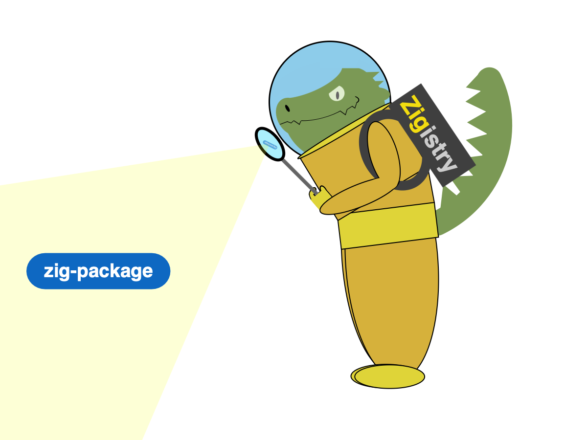

# Zigistry 🦎

## What is Zigistry?

Zigistry is an index for both packages and programs written in the Zig programming language. It serves as a central hub where Zig developers can discover useful libraries and applications created by the community. The platform makes it simple to find Zig projects, whether looking for library dependencies or complete programs.

## Adding to the Index

Zigistry automatically indexes GitHub repositories based on topics:

### Libraries

- Add the `zig-package` topic to index a library
- Examples: parsing libraries, networking tools, testing frameworks

### Programs

- Add the `zig` topic to index a program
- Examples: command-line tools, applications, games

The project will appear on [zigistry.dev](https://zigistry.dev) automatically after adding the appropriate topic.

## Community Interaction

The Zig community can:

- Share and discover both libraries and programs
- Explore different approaches to Zig code
- Ask questions and share Zig development knowledge
- Participate in technical discussions

## Contributing

Contributions to improve Zigistry are welcome through:

- Bug reports and feature suggestions via issues
- Code improvements via pull requests
- Technical discussions about the project
- Helping other developers with questions

## Technical Details

Zigistry is a polyglot project that leverages multiple programming languages and technologies to provide a robust package and program index. Check the [issue tracker](https://github.com/zigistry/zigistry/issues) for current development tasks and feature requests.

## License Notice

The Zigistry codebase is open source. The `database` directory contains files automatically generated through GitHub's API and is subject to GitHub's terms of service.

---

Build something great with Zig! ⚡
